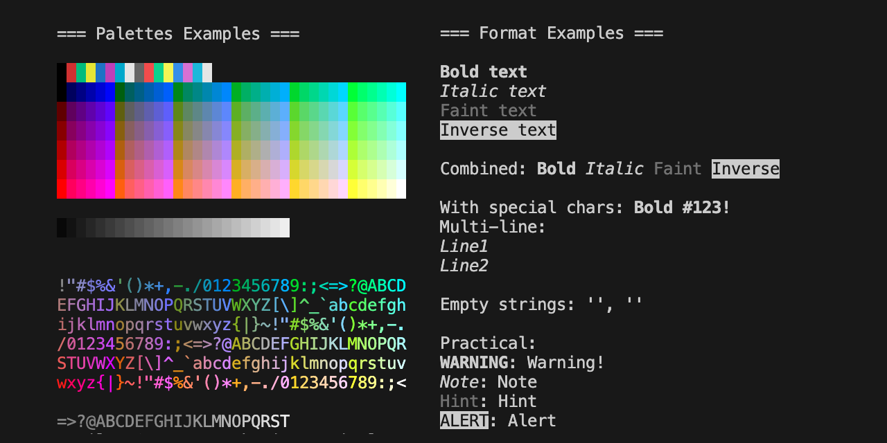

# terminal_style

A minimal Rust library for styling terminal text using ANSI escape codes. Supports 256-color and bold, italic, faint, and inverse formatting. Easily apply foreground/background colors from hex, RGB, or ANSI 8-bit values.

 

## Installation

`terminal_style` is published as a [crate](https://crates.io/crates/terminal_style) on crates.io.

```bash
cargo install terminal_style
```

## Features

- Convert RGB or Hex to ANSI 256-color
- Apply foreground/background color to strings
- Format text as **bold**, *italic*, faint, or inverse
- Graceful handling of invalid color inputs

## Usage

```rust
use terminal_style::{format::{bold, color, background}, color::ColorConversionError};

fn main() -> Result<(), ColorConversionError> {
    let text = "Styled!";
    let fg = color("#FF5733", text)?;
    let bg = background("00FF00", text)?;
    let styled = bold(&fg);

    println!("FG: {}", fg);
    println!("BG: {}", bg);
    println!("Bold: {}", styled);

    Ok(())
}
```

## Color Conversion Examples

```rust
use terminal_style::color::*;

fn main() {
    // RGB to Hex
    assert_eq!(rgb_to_hex([255, 165, 0]), "#FFA500");

    // Hex to RGB
    assert_eq!(hex_to_rgb("#00FF00"), [0, 255, 0]);

    // RGB to ANSI
    assert_eq!(rgb_to_ansi8([255, 0, 0]), 196);

    // Hex to ANSI
    assert_eq!(hex_to_ansi8("0000FF"), 21);

    // ANSI to RGB
    assert_eq!(ansi8_to_rgb(46), Some([0, 255, 0]));

    // ANSI to HEX
    assert_eq!(ansi8_to_hex(196), "#FF0000"); // Red
}
```

Additional examples in the `examples` folder.

## Tests

```bash
cargo test
```

## Structure

- `color/`: Utility color conversions (hex, rgb, ansi)
- `format/`: Terminal text styling functions
- `tests/`: Test suite
- `examples/`: Usage examples

## Authors

[Ron Ilan](https://www.ronilan.com)

## License
[MIT](https://en.wikipedia.org/wiki/MIT_License)

Fabriqué au Canada : Made in Canada 🇨🇦

Vibe coded to Rust, based on the lovingly handcrafted [colors.crumb](https://github.com/ronilan/colors.crumb) which was derived from work done on [Impossible.js](https://github.com/ronilan/that-is-impossible). Enjoy.
